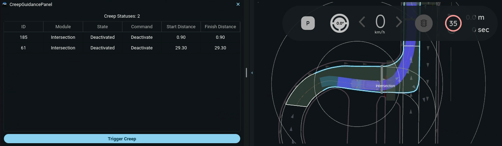

# tier4_creep_guidance_rviz_plugin

## Purpose

The purpose of this Rviz plugin is to display and manage creep guidance status.

## Inputs / Outputs

### Input

| Name                             | Type                                             | Description                                                                                                                                                                                                                    |
| -------------------------------- | ------------------------------------------------ | ------------------------------------------------------------------------------------------------------------------------------------------------------------------------------------------------------------------------------ |
| `/api/external/get/creep_status` | `tier4_creep_guidance_msgs/msg/CreepStatusArray` | Subscribes to creep guidance status messages containing information about various creep guidance modules (Crosswalk, Intersection, Intersection Occlusion) with their states, commands, start distances, and finish distances. |

### Output

| Name                                       | Type                                                | Description                                                                                                                               |
| ------------------------------------------ | --------------------------------------------------- | ----------------------------------------------------------------------------------------------------------------------------------------- |
| `/api/external/set/creep_trigger_commands` | `tier4_creep_guidance_msgs/srv/CreepTriggerCommand` | Service client that sends creep trigger commands to activate creep guidance for the nearest module (the one with minimum start_distance). |
