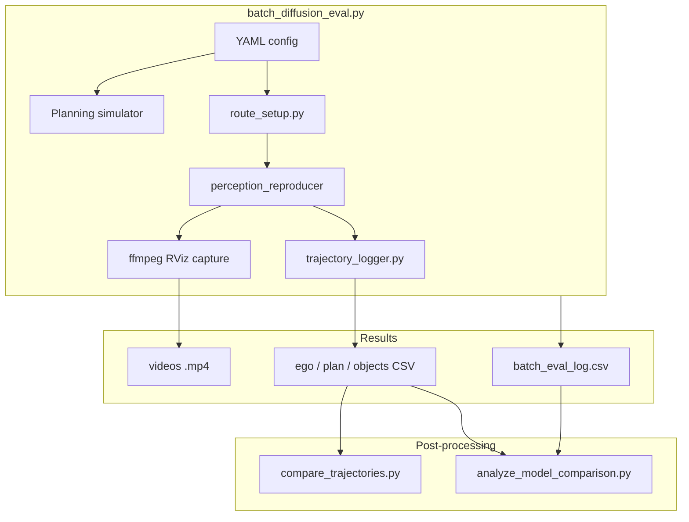

# diffusion_planner_batch_eval

Batch evaluation toolkit for **diffusion planner** ONNX models using Autoware **planning simulator**, **perception reproducer**, and optional **RViz video capture**.

Run many rosbags × many models, collect videos + CSV traces, then compare models visually and quantitatively (path metrics, goal stop error, NPC collision, lanelet boundary checks).

---

## Table of contents

1. [Overview](#overview)
2. [Architecture](#architecture)
3. [Prerequisites](#prerequisites)
4. [Build](#build)
5. [Configuration](#configuration)
6. [Execution](#execution)
7. [Per-bag workflow](#per-bag-workflow)
8. [Output layout](#output-layout)
9. [Post-processing tools](#post-processing-tools)
10. [Quantitative metrics reference](#quantitative-metrics-reference)
11. [Troubleshooting](#troubleshooting)
12. [Package layout](#package-layout)

---

## Overview

| Capability | Tool |
|------------|------|
| Batch run rosbags with multiple diffusion planner models | `batch_diffusion_eval.py` |
| Set initial pose + route goal from rosbag | `route_setup.py` |
| Log ego pose, planned trajectory, tracked objects | `trajectory_logger.py` |
| Interactive multi-model trajectory plot | `compare_trajectories.py` |
| Interactive comfort / control time-series plots | `compare_comfort.py` |
| Quantitative model comparison + safety metrics | `analyze_model_comparison.py` |
| Jerk / harsh deceleration from ego traces | `comfort_metrics.py` |

Typical use case: compare a **baseline** model vs a **new training checkpoint** on ~100 Hiratsuka rosbags, then rank models by success rate, goal accuracy, curb contact, and NPC proximity.

---

## Architecture



**Data sources during a run**

- **Route** — initial pose and goal from the rosbag (`/localization/kinematic_state` or `/tf`).
- **Perception** — `planning_debug_tools` perception reproducer replays tracked objects synced to ego position (`-p -t`).
- **Planning** — diffusion planner in planning simulator produces `/planning/trajectory`.
- **Ego motion** — simple planning simulator integrator (no physical collision simulation).

---

## Prerequisites

### Software

- Autoware workspace built with:
  - `autoware_launch` (planning simulator + diffusion planner)
  - `planning_debug_tools` (perception reproducer)
  - `diffusion_planner_batch_eval` (this package)
- For lanelet boundary analysis: `autoware_lanelet2_extension_python`, `python3-lanelet2`
- **ffmpeg** (optional, for video recording)
- **X11 display** with RViz visible (optional, for video; dual-monitor setups supported)
- **matplotlib** (for `compare_trajectories.py`)

### Runtime environment

```bash
source /path/to/autoware/install/setup.bash
export ROS_DOMAIN_ID=0   # must match planning simulator terminal
```

### Rosbags

- Directory tree of `.db3` files or rosbag2 folders with `metadata.yaml`
- Must contain `/localization/kinematic_state` **or** `/tf` with `base_link` for route setup

### Models

Each model entry needs either:

```yaml
- name: my_model
  onnx_model_path: /path/to/diffusion_planner.onnx
  args_path: /path/to/args.json
```

or a full param file:

```yaml
- name: my_model
  param_yaml: /path/to/diffusion_planner.param.yaml
```

---

## Build

```bash
cd /path/to/autoware/workspace
colcon build --packages-select diffusion_planner_batch_eval
source install/setup.bash
```

---

## Configuration

Copy the example config and edit paths:

```bash
cp install/diffusion_planner_batch_eval/share/diffusion_planner_batch_eval/config/example_config.yaml \
   ~/diffusion_batch_config.yaml
```

Or from source:

```bash
cp src/tools/planning/diffusion_planner_batch_eval/config/example_config.yaml \
   ~/diffusion_batch_config.yaml
```

### Key batch settings

| Parameter | Default | Description |
|-----------|---------|-------------|
| `rosbag_dir` | — | Root folder of evaluation rosbags |
| `output_dir` | — | Where videos, CSVs, and analysis are written |
| `map_path` | `/opt/autoware/maps` | Lanelet2 map directory |
| `vehicle_model` | `lv828l` | Vehicle description package |
| `sensor_model` | `aip_x2_gen2` | Sensor kit for psim launch |
| `manage_psim` | `false` | `true` = batch tool launches psim; `false` = you launch psim manually |
| `skip_existing` | `true` | Skip bags that already have valid video + trace outputs |
| `record_video` | `true` | ffmpeg capture (default: starts **with reproducer**) |
| `record_trajectories` | `true` | CSV logging via `trajectory_logger.py` |
| `auto_engage` | `true` | Engage Auto via AD API **after** reproducer publishes objects |
| `perception_ready_before_engage` | `false` | Reserved (engage always waits for perception when `auto_engage: true`) |
| `video_start_after_engage` | `false` | `true` = ffmpeg starts only after Auto is confirmed |
| `stuck_timeout_sec` | `45.0` | End run if ego speed stays low after `run_grace_sec` |
| `route_timeout_sec` | `120` | Max wait for route ARRIVED |

### RViz — ego-centered view (`base_link`)

For batch eval videos, set RViz to follow the ego before starting a run:

1. **Global Options** → **Fixed Frame** → `base_link`
2. **Views** panel → **Current View** → **Target Frame** → `base_link`
3. Toolbar → **Bird Eye View** (or Third Person View with top-down pitch)

The map and objects move relative to the vehicle while the ego stays centered — useful for comparing planner behavior across models on recorded videos.

To persist these settings, use **File → Save Config As…** in RViz and pass that file when launching psim:

```bash
ros2 launch autoware_launch planning_simulator.launch.xml \
  ... \
  rviz_config:=/path/to/your_saved.rviz
```

### Model swapping

When `manage_psim: true`, the batch tool:

1. Deploys a generated `diffusion_planner.param.yaml` per model (ONNX path from config)
2. Launches planning simulator for that model
3. Runs all bags
4. Stops psim before switching to the next model

When `manage_psim: false` (recommended for debugging), **you** restart psim with the correct model param between model blocks.

### Analysis section (`analysis:`)

Used by `analyze_model_comparison.py` when passed `-c ~/diffusion_batch_config.yaml`:

```yaml
analysis:
  lanelet_boundary_check: false
  boundary_types: [road_border, curbstone]
  lanelet_sample_dt: 0.2
  goal_stop_speed_threshold: 0.2
  goal_min_move_m: 0.1
  npc_sample_dt: 0.2
  npc_near_miss_threshold_m: 0.5
  npc_labels: [CAR, TRUCK, BUS, TRAILER, MOTORCYCLE, BICYCLE]
  comfort_sample_dt: 0.1
  harsh_decel_threshold_mps2: -2.5
  harsh_decel_min_duration_sec: 0.3
```

---

## Execution

### 1. Verify ffmpeg (optional)

```bash
ros2 run diffusion_planner_batch_eval batch_diffusion_eval.py \
  -c ~/diffusion_batch_config.yaml --test-ffmpeg
```

Writes a 2-second test clip under `output_dir` and checks DISPLAY / RViz window detection.

### 2. Dry run

```bash
ros2 run diffusion_planner_batch_eval batch_diffusion_eval.py \
  -c ~/diffusion_batch_config.yaml --dry-run
```

Lists bags and paths without launching anything.

### 3. Full batch — manual psim (`manage_psim: false`)

**Terminal 1** — planning simulator + RViz:

```bash
source install/setup.bash
ros2 launch autoware_launch planning_simulator.launch.xml \
  map_path:=/opt/autoware/maps \
  vehicle_model:=lv828l \
  sensor_model:=aip_x2_gen2 \
  planning_setting:=diffusion_planner
```

Set RViz **Fixed Frame** and **Target Frame** to `base_link` (see above) before the batch run starts.

**Terminal 2** — batch eval:

```bash
source install/setup.bash
ros2 run diffusion_planner_batch_eval batch_diffusion_eval.py \
  -c ~/diffusion_batch_config.yaml
```

For multiple models with `manage_psim: false`, swap the deployed diffusion planner param and restart psim between model blocks (or run one model per psim session).

### 4. Full batch — managed psim (`manage_psim: true`)

Single terminal:

```bash
ros2 run diffusion_planner_batch_eval batch_diffusion_eval.py \
  -c ~/diffusion_batch_config.yaml
```

Do **not** launch psim manually when `manage_psim: true`.

### 5. Standalone route setup (debug)

```bash
ros2 run diffusion_planner_batch_eval route_setup.py \
  -b /path/to/rosbag.db3 --backend auto
```

### 6. Standalone trajectory logger

```bash
ros2 run diffusion_planner_batch_eval trajectory_logger.py \
  -o /tmp/trace_log --model-name debug --bag-path /path/to/bag.db3
```

---

## Per-bag workflow

**Default workflow:**

```
1. Clear route → set initial pose → set goal (from rosbag) — no engage yet
2. Start trajectory_logger + perception_reproducer (+ ffmpeg unless deferred video)
3. Wait for perception objects → engage Auto
4. Wait until ARRIVED / stuck / timeout
5. Stop reproducer, ffmpeg, logger; disengage for next bag
```

Engage happens **after** the reproducer is publishing. Engaging during route setup was dropped back to STOP when the reproducer started (`mode=STOP` in run logs).

**Optional:** skip idle video at the start of each clip:

```yaml
video_start_after_engage: true
```

**Run status** values in `batch_eval_log.csv`:

| Status | Meaning |
|--------|---------|
| `success` | Route reached ARRIVED |
| `stuck` | Ego nearly stopped too long (often perception/planner deadlock) |
| `timeout` | Route did not complete in time |
| `route_setup_failed` | Could not set pose/route |
| `error` | Unexpected failure |

---

## Output layout

```
output_dir/
├── batch_eval_log.csv
├── model_a/
│   └── ID1/
│       └── bag_name.mp4                    # video (if enabled)
│       └── bag_name/                       # trace directory
│           ├── ego_pose.csv
│           ├── ego_accel.csv
│           ├── control_cmd.csv
│           ├── planned_trajectory.csv
│           ├── objects.csv
│           └── metadata.json
├── comparisons/
│   └── comfort/                            # from compare_comfort.py --render-all
├── model_b/
│   └── ...
└── quantitative_analysis/                  # from analyze_model_comparison.py
    ├── per_model_run_summary.csv
    ├── per_model_per_bag.csv
    ├── pairwise_per_bag.csv
    ├── per_model_per_bag_goal_stop.csv
    ├── per_model_per_bag_npc_collision.csv
    ├── per_model_per_bag_comfort.csv
    ├── per_model_per_bag_lanelet_boundary.csv   # if --lanelet-boundary-check
    └── .goal_pose_cache.json
```

### CSV schemas (trajectory logger)

**ego_pose.csv** — `/localization/kinematic_state`

| Column | Description |
|--------|-------------|
| `stamp_sec` | ROS time [s] |
| `x`, `y`, `z` | Position in map frame |
| `yaw_rad` | Heading |
| `vx`, `vy`, `speed_mps` | Velocity |

**ego_accel.csv** — `/localization/acceleration` (base_link; preferred for comfort metrics)

| Column | Description |
|--------|-------------|
| `stamp_sec` | ROS time [s] |
| `ax_mps2`, `ay_mps2`, `az_mps2` | Linear acceleration in base_link |
| `a_long_mps2`, `a_lat_mps2` | Longitudinal / lateral (= x / y in base_link) |

**control_cmd.csv** — `/control/command/control_cmd`

| Column | Description |
|--------|-------------|
| `stamp_sec` | Command time [s] |
| `cmd_velocity_mps` | Commanded longitudinal speed |
| `cmd_acceleration_mps2` | Commanded longitudinal acceleration |
| `cmd_jerk_mps3` | Commanded longitudinal jerk |
| `cmd_steering_tire_angle_rad` | Lateral steering command |
| `cmd_steering_tire_rotation_rate_rps` | Steering rate command |

> **Note:** `ego_accel.csv` and `control_cmd.csv` are written by runs after this update. Re-run batch eval (or at least re-log traces) to populate them. Older traces still work — comfort metrics fall back to velocity differentiation.

**planned_trajectory.csv** — `/planning/trajectory`

| Column | Description |
|--------|-------------|
| `stamp_sec` | Trajectory header time |
| `point_idx` | Index in trajectory |
| `x`, `y`, `z`, `yaw_rad` | Point pose |
| `longitudinal_velocity_mps`, ... | Plan speeds |

**objects.csv** — `/perception/object_recognition/tracking/objects`

| Column | Description |
|--------|-------------|
| `stamp_sec` | Message time |
| `object_id` | UUID hex |
| `label` | CAR, TRUCK, ... |
| `x`, `y`, `z`, `yaw_rad` | Object pose |
| `length_m`, `width_m`, `height_m` | Bounding box size |

---

## Post-processing tools

### Visual comparison — `compare_trajectories.py`

Interactive matplotlib viewer: per-model ego paths, optional planned trajectory overlays, NPC boxes.

```bash
# List available bag keys
ros2 run diffusion_planner_batch_eval compare_trajectories.py \
  -o $RESULTS --list-bags

# Interactive compare two models for one bag
ros2 run diffusion_planner_batch_eval compare_trajectories.py \
  -o $RESULTS \
  --bag-key "ID1/94eca28e-ad92-49ec-9f95-7fedf9ce108c_2025-12-16-10-48-35_p0900_27" \
  --models model_a,model_b

# Batch-render all comparisons to PNG
ros2 run diffusion_planner_batch_eval compare_trajectories.py \
  -o $RESULTS --render-all --models model_a,model_b

# Zoom to goal area
ros2 run diffusion_planner_batch_eval compare_trajectories.py \
  -o $RESULTS --bag-key "ID1/..." --models model_a,model_b \
  --zoom-range 80 --focus end
```

Controls: left-drag pan, scroll zoom.

| Flag | Description |
|------|-------------|
| `--ego-only` | Hide planned trajectory overlays |
| `--snapshot-stamp SEC` | Overlay NPC boxes at time SEC |
| `--save path.png` | Save instead of interactive window |

---

### Comfort / control plots — `compare_comfort.py`

Time-series overlay per model: ego speed, longitudinal acceleration, jerk, plus **control command** and **planned trajectory** profiles. Harsh deceleration regions are shaded (threshold from config / CLI).

```bash
# List bag keys
ros2 run diffusion_planner_batch_eval compare_comfort.py -o $RESULTS --list-bags

# Interactive compare
ros2 run diffusion_planner_batch_eval compare_comfort.py \
  -o $RESULTS \
  --bag-key "ID1/your_bag_name" \
  --models model_a,model_b

# Save PNG
ros2 run diffusion_planner_batch_eval compare_comfort.py \
  -o $RESULTS --bag-key "ID1/..." --models model_a,model_b \
  --save /tmp/comfort.png

# Batch export all bags
ros2 run diffusion_planner_batch_eval compare_comfort.py \
  -o $RESULTS --render-all --models model_a,model_b
```

| Flag | Description |
|------|-------------|
| `--no-control` | Hide `/control/command/control_cmd` overlays |
| `--no-plan` | Hide planned trajectory acceleration overlay |
| `--show-lateral` | Add lateral acceleration subplot |
| `--harsh-decel-threshold-mps2 -2.5` | Shade regions below this longitudinal accel |

**Plot layers**

| Line style | Source |
|------------|--------|
| Solid | Ego motion (`ego_pose.csv` + `ego_accel.csv` if present) |
| Dashed | Control command (`control_cmd.csv`) |
| Dotted | Planned trajectory first point (`planned_trajectory.csv`) |

---

### Quantitative analysis — `analyze_model_comparison.py`

```bash
ros2 run diffusion_planner_batch_eval analyze_model_comparison.py \
  -o $RESULTS \
  --models model_a,model_b \
  -c ~/diffusion_batch_config.yaml
```

Requires **at least two models** in `output_dir`. Writes CSVs to `quantitative_analysis/` (override with `--out-csv`).

#### Always enabled (default)

| Output CSV | Content |
|------------|---------|
| `per_model_run_summary.csv` | Success / stuck / timeout rates per model |
| `per_model_per_bag.csv` | Path length, duration, speed, plan stats |
| `pairwise_per_bag.csv` | Model A vs B metrics on common bags |
| `per_model_per_bag_goal_stop.csv` | Stop pose vs route goal |
| `per_model_per_bag_npc_collision.csv` | Ego vs NPC overlap / near-miss |
| `per_model_per_bag_comfort.csv` | Longitudinal/lateral jerk, harsh deceleration |

#### Optional

```bash
# Lanelet map boundary check (curb / road_border)
--lanelet-boundary-check --map-path /opt/autoware/maps
```

#### Useful flags

| Flag | Description |
|------|-------------|
| `--align-max-dt 0.15` | Max time gap for path alignment [s] |
| `--skip-goal-stop` | Skip goal stop analysis |
| `--skip-npc-collision` | Skip NPC collision analysis |
| `--skip-comfort` | Skip jerk / harsh deceleration analysis |
| `--harsh-decel-threshold-mps2 -2.5` | Harsh decel threshold [m/s²] |
| `--harsh-decel-min-duration-sec 0.3` | Min harsh decel duration [s] |
| `--rosbag-dir /path/to/bags` | Fallback for goal pose lookup |
| `--goal-stop-speed-threshold 0.2` | Speed threshold for stop detection |
| `--npc-near-miss-threshold-m 0.5` | Near-miss distance |
| `--npc-labels CAR,TRUCK,BUS` | NPC types to include |

> **Note:** Pairwise time alignment (`mean_separation_m`, ADE-like) uses absolute `stamp_sec` across separate sim runs. For reliable ADE, align by **time since run start** (future improvement). `hausdorff_m` does not require time alignment.

---

## Quantitative metrics reference

### Run-level (`batch_eval_log.csv`)

- **success_rate** — fraction of bags with `status=success`
- **stuck_rate** — ego stopped / perception deadlock
- **timeout_rate** — route never arrived

### Pairwise path (`pairwise_per_bag.csv`)

| Metric | Meaning |
|--------|---------|
| `mean_separation_m` | Average ego–ego distance at matched timestamps (ADE-like) |
| `max_separation_m` | Worst time-aligned separation |
| `fde_m` | Distance between **last logged poses** (not vs goal) |
| `hausdorff_m` | Max point-to-path gap either direction (shape difference) |
| `stop_shift_*` | Difference in stop position between models |

### Goal stop (`per_model_per_bag_goal_stop.csv`)

Ego stop pose vs rosbag goal (goal frame):

| Metric | Meaning |
|--------|---------|
| `goal_stop_lateral_m` | Left (+) / right (−) offset at stop |
| `goal_stop_longitudinal_m` | Ahead (+) / behind (−) of goal |
| `goal_stop_position_m` | Euclidean distance to goal |
| `goal_stop_heading_deg` | Yaw error at stop |

Stop = first sample in final low-speed segment (`goal_stop_speed_threshold`, default 0.2 m/s).

### NPC collision (`per_model_per_bag_npc_collision.csv`)

Offline OBB check (ego footprint vs tracked object boxes). **Not physics simulation.**

| Metric | Meaning |
|--------|---------|
| `npc_collision_rate` | Fraction of samples with ego/NPC overlap |
| `npc_near_miss_rate` | Close approach without overlap |
| `npc_min_distance_m` | Closest ego-to-NPC distance |
| `had_npc_collision` | 1 if any overlap in the run |

### Comfort (`per_model_per_bag_comfort.csv`)

Computed from `ego_pose.csv` (`vx`, `vy`, `yaw_rad`) in the ego frame. Uses **`ego_accel.csv`** when present (cleaner than differentiating velocity). Optional plan peaks from `planned_trajectory.csv`.

| Metric | Meaning |
|--------|---------|
| `rms_longitudinal_jerk_mps3` | RMS of longitudinal jerk |
| `rms_lateral_jerk_mps3` | RMS of lateral jerk |
| `p95_longitudinal_jerk_mps3` | 95th percentile longitudinal jerk magnitude |
| `p95_lateral_jerk_mps3` | 95th percentile lateral jerk magnitude |
| `max_decel_mps2` | Peak braking magnitude |
| `harsh_decel_count` | Events with `a_long < harsh_decel_threshold` for ≥ `harsh_decel_min_duration_sec` |
| `harsh_decel_ratio` | Fraction of run time in harsh decel |
| `plan_max_longitudinal_accel_mps2` | Peak planned longitudinal accel (if trajectory logged) |

Default thresholds (configurable in `analysis:`): `harsh_decel_threshold_mps2: -2.5`, `harsh_decel_min_duration_sec: 0.3`.

Pairwise diffs (`pairwise_per_bag.csv`): `rms_longitudinal_jerk_diff_mps3`, `harsh_decel_count_diff`, `max_decel_diff_mps2` (model B − A).

`per_model_run_summary.csv` also includes mean comfort metrics per model when comfort analysis is enabled.

### Lanelet boundary (`per_model_per_bag_lanelet_boundary.csv`, optional)

| Metric | Meaning |
|--------|---------|
| `out_of_lane_ratio` | Footprint vertices outside road lanelets |
| `boundary_crossing_ratio` | Footprint intersects `road_border` / `curbstone` |

Use **`boundary_crossing_ratio`** for curb contact. Hiratsuka map uses `road_border`.

---

## Troubleshooting

### Planning simulator not detected

```
[error] manage_psim is false but planning simulator is not running.
```

Launch psim in another terminal or set `manage_psim: true`.

### Auto engage fails

- Increase `perception_ready_timeout_sec` and `auto_engage_timeout_sec`
- Check reproducer is publishing `/perception/object_recognition/tracking/objects`
- Try `reproducer_search_radius: 0` if perception freezes when ego stops

### Goal not set but vehicle engages / route cannot be cleared

Autoware refuses `clear_route` while the vehicle is in **Auto** and moving (`The route cannot be cleared while it is in use`). Between batch bags the previous run may still be engaged, so the next bag cannot reset the goal.

The batch tool now:

1. **Disengages** (change to Stop) and waits for low speed after each bag
2. **Disengages before route clear** when setting up the next bag
3. **Verifies route SET** before calling Auto engage
4. **Skips engage** if the goal was not confirmed

If route setup still fails:

- Stop the vehicle manually (Stop mode in RViz) before the next bag
- Run standalone route debug: `ros2 run diffusion_planner_batch_eval route_setup.py -b /path/to/bag.db3`
- Try `route_backend: mission_planner` if AD API route does not show the goal in RViz
- Ensure `initial_engage_state: false` in planning simulator launch so psim does not auto-engage without a route

### `set_route_rejected: The planned route is empty`

Mission planner could not find a drivable lanelet path between ego and the bag goal. Common causes:

1. **Ego pose lag** — routing uses `/localization/kinematic_state`, not `/initialpose`. The tool now waits for ego to reach the bag start before `set_route` and retries up to 3×.
2. **Wrong map** — Hiratsuka bags need the matching lanelet map in planning simulator.
3. **Goal off drivable area** — bag end pose is not on a routable lane (parking lot, shoulder, etc.). Try another bag or adjust `goal_min_move_m`.
4. **Backend** — try `route_backend: adapi` if `mission_planner` keeps failing.

On failure the log now includes `start=(x,y) goal=(x,y) ego=(x,y)` for debugging. Test one bag manually:

```bash
ros2 run diffusion_planner_batch_eval route_setup.py \
  -b /path/to/bag.db3 --backend mission_planner
```

If manual route setup also fails in RViz for that bag, the bag or map is the issue — not the batch tool.

### Routing services not ready between bags

After a failed bag you may see `Waiting for routing services (adapi=False, mission_planner=False)`. Usually DDS rediscovery on a new node (waits up to `route_service_wait_sec`). If it persists past 2 minutes, restart planning simulator — mission planner may have wedged.

### Ego stuck / `status=stuck` (route OK but speed stays 0)

If setup shows `route_set_via_adapi` / `autonomous_engaged` but the run logs `speed=0.00m/s`:

1. **Check `mode=` in run logs** — must be `AUTO`. If `STOP`, engage did not hold; click Auto in RViz or check `initial_engage_state` in psim launch.
2. **Perception reproducer freeze** — with `reproducer_search_radius: 1.5`, when ego stops, perception repeats the same frame and a lead vehicle can block diffusion planner forever. **Set `reproducer_search_radius: 0`** in your config.
3. **Perception not stable** — if you see `perception_ready_timeout`, increase `perception_ready_timeout_sec` or lower `perception_ready_stable_sec`.
4. Planner may still publish trajectories while ego is stuck — check the video and `planned_trajectory.csv`.

```yaml
reproducer_search_radius: 0
perception_ready_timeout_sec: 60.0
perception_ready_stable_sec: 1.0
run_grace_sec: 30.0
```

When ego moves briefly then stops (e.g. `speed=4.25` then `0.00`), that is the classic reproducer freeze — `reproducer_search_radius: 0` is the main fix. Lower `stuck_timeout_sec` only if you want faster skip to the next bag.

### Video is black (file exists but empty/black content)

Common causes on Linux + RViz2:

1. **Wrong display** — batch terminal captures `:0` but RViz is on `:1` (dual monitor).
   ```yaml
   display: ":1"   # or ":0" — match where RViz actually runs
   ```
   Verify: `echo $DISPLAY` in the **psim terminal** vs **batch terminal** (must be the same machine).

2. **RViz not visible** — minimized, on another workspace, or covered. Keep RViz **unminimized** on screen during recording.

3. **Wayland** — `ffmpeg -f x11grab` often records black under native Wayland. Use an **X11** desktop session, or log in via Xorg.

4. **SSH / remote** — batch job runs without GUI access to the local display. Run batch eval on the **same machine and desktop** as RViz (not headless SSH).

5. **Preflight check** — always run first; it now detects black clips:
   ```bash
   ros2 run diffusion_planner_batch_eval batch_diffusion_eval.py \
     -c ~/diffusion_batch_config.yaml --test-ffmpeg
   ```
   Watch the 2s test clip at `output_dir/.ffmpeg_preflight.mp4`.

**Workarounds if x11grab stays black:**

```yaml
video_capture: display   # full screen instead of RViz window
video_size: auto
display: ":0"            # explicit display where RViz is visible
```

Ensure RViz fills most of that display. The tool now uses **ffmpeg `-window_id`** for RViz capture (more reliable for OpenGL windows than screen coordinates).

### No video recorded

- Run `--test-ffmpeg` first
- Set `display: ":1"` if RViz is on external monitor
- Video starts **with reproducer** by default (`video_start_after_engage: false`)
- With `video_start_after_engage: true`, video only starts after Auto engage — if engage fails, video is skipped
- Check `video_capture: rviz` and `video_window_name: rviz`

### Video shifted / tiled

- Set `video_size: auto`
- Tune `video_capture_offset_x/y`
- Use `video_capture: rviz` (not full screen)
- Confirm RViz **Fixed Frame** and **Target Frame** are set to `base_link`

### Goal stop / NPC analysis `bag_path_unresolved`

- Ensure `metadata.json` in trace dir contains `bag_path`
- Or pass `--rosbag-dir` matching batch config
- Or ensure `batch_eval_log.csv` exists in `output_dir`

### Lanelet analysis fails

```bash
# Verify map loads
python3 -c "
from pathlib import Path
from autoware_lanelet2_extension_python.projection import MGRSProjector
from lanelet2.io import Origin, load
load('/opt/autoware/maps/lanelet2_map.osm', MGRSProjector(Origin(0,0)))
print('ok')
"
```

### Hausdorff / analysis very slow

Pairwise Hausdorff is O(n²) on full ego paths. For quick analysis:

```bash
# Skip optional heavy checks; consider analyzing subset of bags manually
```

---

## Package layout

```
diffusion_planner_batch_eval/
├── README.md
├── CMakeLists.txt
├── package.xml
├── config/
│   └── example_config.yaml
└── scripts/
    ├── batch_diffusion_eval.py      # Main orchestrator
    ├── route_setup.py               # Initial pose + route + Auto engage
    ├── rosbag_utils.py              # Bag discovery, paths, duration
    ├── trajectory_logger.py         # CSV logger node
    ├── compare_trajectories.py      # Visual comparison
    ├── compare_comfort.py           # Comfort / control time-series plots
    ├── analyze_model_comparison.py  # Quantitative analysis
    ├── goal_stop_error.py           # Goal stop metrics
    ├── comfort_metrics.py           # Jerk / harsh deceleration
    ├── npc_collision_check.py       # NPC overlap / near-miss
    └── lanelet_boundary_check.py    # Map boundary / out-of-lane
```

---

## Example end-to-end workflow

```bash
# 1. Config
cp install/diffusion_planner_batch_eval/share/diffusion_planner_batch_eval/config/example_config.yaml \
   ~/diffusion_batch_config.yaml
# Edit rosbag_dir, output_dir, models, map_path

# 2. Build
colcon build --packages-select diffusion_planner_batch_eval
source install/setup.bash

# 3. Test video capture
ros2 run diffusion_planner_batch_eval batch_diffusion_eval.py \
  -c ~/diffusion_batch_config.yaml --test-ffmpeg

# 4. Launch psim (terminal 1) if manage_psim: false
ros2 launch autoware_launch planning_simulator.launch.xml \
  planning_setting:=diffusion_planner map_path:=/opt/autoware/maps
# In RViz: Fixed Frame + Target Frame → base_link (Bird Eye View)

# 5. Batch eval (terminal 2)
ros2 run diffusion_planner_batch_eval batch_diffusion_eval.py \
  -c ~/diffusion_batch_config.yaml

# 6. Visual compare
export RESULTS=/path/to/output_dir
ros2 run diffusion_planner_batch_eval compare_trajectories.py \
  -o $RESULTS --list-bags
ros2 run diffusion_planner_batch_eval compare_trajectories.py \
  -o $RESULTS --bag-key "ID1/your_bag_name" --models model_a,model_b

# 7. Quantitative analysis
ros2 run diffusion_planner_batch_eval analyze_model_comparison.py \
  -o $RESULTS \
  --models model_a,model_b \
  -c ~/diffusion_batch_config.yaml \
  --lanelet-boundary-check
```

---

## License

Apache License 2.0 — see package headers.
