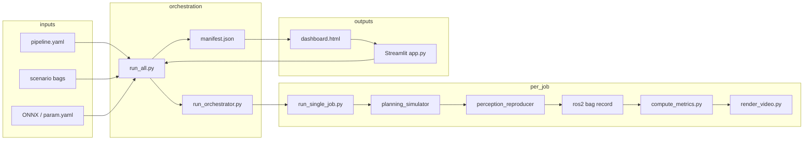

# Architecture

Design and code map for `dp_multi_eval`.

---

## Data flow



---

## Pipeline phases

| Phase | Module | Responsibility |
|-------|--------|----------------|
| 1 | `run_single_job.py` | Launch psim with per-job AMENT overlay, route setup, engage, record bag |
| 2 | `compute_metrics.py` | Stuck, OOB, collision, goal-stop precision → `metrics.json` |
| 3 | `render_video.py` | Headless top-down `preview.mp4` with ego trail + planned trajectory |
| 4 | `generate_manifest.py`, `run_orchestrator.py` | Build job matrix, parallel workers, resumable execution |
| 5 | `build_dashboard.py` | Single-file HTML summary (auto-refresh while running) |
| 6 | `run_all.py` | End-to-end: manifest → orchestrate → retry failed → dashboard |
| 7 | `app.py` | Streamlit GUI (start/stop run, live progress, embedded dashboard) |

---

## Key design choices

- **Per-job AMENT overlay** (`ament_overlay.py`): clones `autoware_launch` share tree and swaps `diffusion_planner.param.yaml` so parallel jobs do not fight over the same ONNX path. Overlay root is under `/tmp/dp_multi_eval_overlays/` (cross-device safe via copy fallback).
- **Route setup in-process** (reuses `diffusion_planner_batch_eval` route helpers): no Auto engage during route; engage after perception reproducer is warm.
- **Hiratsuka stop-point fallbacks**: if primary start→goal routing fails, alternate start poses from bag metadata are tried.
- **RViz off** by default (`rviz: false`): all visualization is offline.
- **Single bag read** in orchestrator post-phase: metrics + video share one `load_bag_series()` call for speed.
- **Process groups** (`process_utils.py`): psim and reproducer run in new sessions; GUI `run_all` uses `start_new_session=True` for clean stop via `killpg`.

---

## Code map

| Area | Files |
|------|-------|
| Job lifecycle | `run_single_job.py`, `job_status.py`, `process_utils.py` |
| Parallel safety | `ament_overlay.py`, `model_config.py` |
| Orchestration | `run_orchestrator.py`, `run_all.py`, `generate_manifest.py` |
| Metrics | `compute_metrics.py`, `geometry.py`, `bag_reader.py`, `config/thresholds.yaml` |
| Video | `render_video.py` |
| Dashboard / GUI | `build_dashboard.py`, `app.py` |
| Route setup (external) | `diffusion_planner_batch_eval` route_setup helpers |

---

## Output layout

```
{results_root}/{run_name}/
  manifest.json
  dashboard.html
  pipeline_config.yaml
  run_all.log
  .gui_run_state.json          # only while GUI run is active
  {model_name}/{bag_key}/
    job_status.json
    goal_pose.json
    metrics.json
    preview.mp4
    psim_launch.log
    output/                    # recorded rosbag2 (absent if route setup failed)
    .ament_overlay/
```

---

## Package layout

```
src/tools/planning/dp_multi_eval/
  README.md
  docs/
    HEADLESS.md               # headless CLI pipeline (main feature)
    GUI_TESTING.md
    OPERATIONS.md
    ARCHITECTURE.md
    REVIEW.md
  package.xml
  CMakeLists.txt
  config/
    example_pipeline.yaml
    thresholds.yaml
    topics.yaml
  dp_multi_eval/
    app.py
    run_all.py
    run_single_job.py
    run_orchestrator.py
    compute_metrics.py
    render_video.py
    build_dashboard.py
    ament_overlay.py
    ...
  scripts/                    # ros2 run wrappers
```

---

## Dependency on `diffusion_planner_batch_eval`

| Concern | Owner |
|---------|-------|
| Route setup, Hiratsuka fallbacks, engage flow | `diffusion_planner_batch_eval` |
| Headless M×N orchestration, offline metrics/video, dashboard | [HEADLESS.md](HEADLESS.md) |
| Streamlit GUI | `app.py` — [GUI_TESTING.md](GUI_TESTING.md) |

Do not duplicate route-setup logic in `dp_multi_eval`; extend batch_eval if routing behavior must change for both tools.
