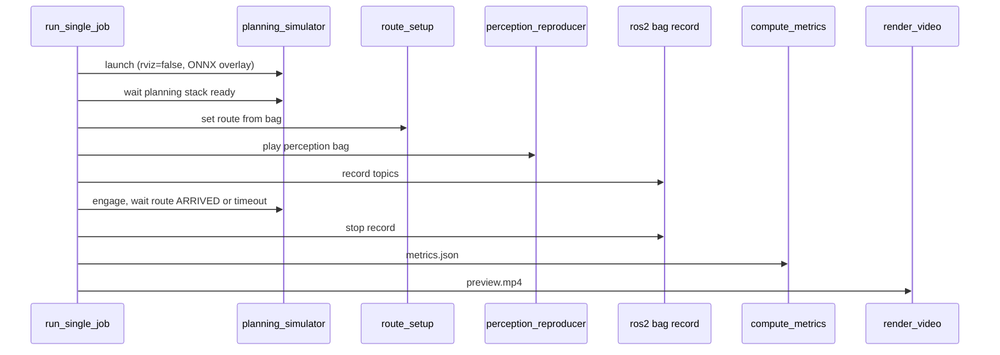

# Headless evaluation pipeline

**CLI-only batch evaluation** for Diffusion Planner — no RViz, no Streamlit, no live video capture.

This is the core feature of `dp_multi_eval`: run many scenarios × many models on planning simulator, record rosbags, compute metrics offline, render top-down preview MP4s, and open a static HTML dashboard. Suitable for overnight regression on a GPU server or CI-style batch runs.

| Mode | Entry point | Doc |
|------|-------------|-----|
| **Headless (this doc)** | `run_all.py`, `run_orchestrator.py` | You are here |
| Streamlit GUI | `app.py` | [GUI_TESTING.md](GUI_TESTING.md) |
| Interactive debug | `diffusion_planner_batch_eval` | [batch_eval README](../../diffusion_planner_batch_eval/README.md) |

---

## What “headless” means here

| | `diffusion_planner_batch_eval` | **dp_multi_eval headless** |
|--|-------------------------------|----------------------------|
| Display | RViz + ffmpeg | **None** (`rviz: false`) |
| Recording | CSV traces | **rosbag2** per job |
| Video | Live screen capture | **Offline** `preview.mp4` from bag |
| UI | Terminal scripts | **`run_all.py`** + `dashboard.html` |
| Parallelism | Sequential | **`ROS_DOMAIN_ID` pool** |
| Resume | Manual | **Manifest** skips `done` jobs |

---

## Prerequisites

- Built workspace: `dp_multi_eval`, `diffusion_planner_batch_eval`, `autoware_launch`, planning simulator
- NVIDIA GPU with TensorRT diffusion planner (start with `max_workers: 1`)
- Scenario bags: `ID1`, `ID2`, … folders with `metadata.yaml` or `.db3`
- Map at `map_path` must match bag coordinates (Hiratsuka bags → Hiratsuka map)
- No Streamlit required for headless runs

---

## Build

```bash
cd <workspace>
colcon build --packages-select dp_multi_eval diffusion_planner_batch_eval --allow-overriding dp_multi_eval
source install/setup.bash
```

---

## Configuration

```bash
cp src/tools/planning/dp_multi_eval/config/example_pipeline.yaml ~/dp_multi_eval_pipeline.yaml
```

Edit at minimum:

```yaml
rosbag_dir: /path/to/hiratsuka          # parent of ID1, ID2, …
results_root: /path/to/dp_multi_eval_results
map_path: /opt/autoware/maps

vehicle_model: lv828l
sensor_model: aip_x2_gen2
vehicle_id: 6_lv828l

max_workers: 1                          # strongly recommended on one GPU
domain_id_start: 10
rviz: false                             # headless default

route_timeout_sec: 300.0
psim_startup_sec: 120.0
render_video: true                      # false = faster batch
video_sample_dt: 0.5
video_view_frame: base_link             # or map (fit full path)
video_view_range_m: 40.0                # ego window half-extent for base_link
show_planning_factors: true             # virtual walls in preview.mp4

models:
  - name: diffusion_planner_for_erga_hiratsuka_june_26
    model_config: /opt/autoware/mlmodels/diffusion_planner_for_erga_hiratsuka_june_26
```

`model_config` may be an ONNX directory (`diffusion_planner.onnx` + `args.json`) or a `*.param.yaml` file.

---

## Quick start (headless)

```bash
source install/setup.bash

# 1. Validate config + manifest (no psim)
ros2 run dp_multi_eval run_all.py -c ~/dp_multi_eval_pipeline.yaml --dry_run

# 2. Full batch
ros2 run dp_multi_eval run_all.py -c ~/dp_multi_eval_pipeline.yaml --max_workers 1

# 3. Open results
xdg-open ~/dp_multi_eval_results/dashboard.html
# or per-run: xdg-open ~/dp_multi_eval_results/run_*/dashboard.html
```

`run_all.py` does: generate manifest → run pending jobs → **one automatic retry** for failures → rebuild `dashboard.html`.

---

## Per-job pipeline (what runs for each scenario)



Phases tracked in `{output_dir}/job_status.json`: `psim_startup` → `route_setup` → `reproducer` → `simulation` → `post_processing`.

---

## CLI reference

### Full pipeline

```bash
ros2 run dp_multi_eval run_all.py -c ~/dp_multi_eval_pipeline.yaml [--max_workers N] [--dry_run] [--max_retries 1]
```

### Orchestrator only (resume / retry)

```bash
ros2 run dp_multi_eval run_orchestrator.py \
  --manifest /path/to/results/manifest.json \
  -c ~/dp_multi_eval_pipeline.yaml \
  --max_workers 1 \
  --domain_ids 10
```

### Single scenario (debug)

```bash
ros2 run dp_multi_eval run_single_job.py \
  --model_config /opt/autoware/mlmodels/diffusion_planner_for_erga_hiratsuka_june_26 \
  --bag_path /path/to/hiratsuka/ID1 \
  --output_dir /tmp/dp_test_ID1 \
  --domain_id 10 \
  --map_path /opt/autoware/maps
```

### Metrics only (no resim)

```bash
ros2 run dp_multi_eval compute_metrics.py \
  --bag_path /path/to/job/output \
  --map_path /opt/autoware/maps \
  --goal_pose X Y YAW \
  --thresholds $(ros2 pkg prefix dp_multi_eval)/share/dp_multi_eval/config/thresholds.yaml \
  --output /path/to/job/metrics.json
```

### Rebuild dashboard

```bash
ros2 run dp_multi_eval build_dashboard.py \
  --manifest /path/to/results/manifest.json \
  --output /path/to/results/dashboard.html
```

---

## Output layout

```
{results_root}/
  manifest.json              # job matrix + status (resume source of truth)
  dashboard.html             # when results_root is run directory root
  {model_name}/{bag_key}/
    job_status.json
    goal_pose.json
    metrics.json
    preview.mp4
    psim_launch.log
    output/                  # rosbag2 (missing if route setup failed)
    .ament_overlay/
```

GUI-started runs use `{results_root}/{run_name}/` as the run directory (manifest + dashboard inside that folder).

---

## Resume and retry

- **`done` jobs with `output/` bag** are never re-run
- **`failed` jobs** get one retry pass inside `run_all.py` (`--max_retries 1` default)
- To retry again manually:

```bash
ros2 run dp_multi_eval run_all.py -c /path/to/run_*/pipeline_config.yaml --max_workers 1
```

---

## Stopping a headless run

```bash
# If started from terminal — Ctrl+C may leave orphans; prefer:
pkill -f "dp_multi_eval.run_all"
pkill -f "planning_simulator.launch"
pkill -f "perception_reproducer.py"
pkill -f "ros2 bag record"

# Verify clean ROS domain
source install/setup.bash
ROS_DOMAIN_ID=10 ros2 node list | sort | uniq -d   # empty = good
```

Stale processes on `ROS_DOMAIN_ID=10` cause `planning_stack_not_ready` for every subsequent job.

---

## After a run

1. Open `dashboard.html` — scenario × model grid, PASS/FAIL, click cells for metrics detail
2. Inspect failures — `job_status.json` error + `psim_launch.log`
3. Watch `preview.mp4` for driving failures
4. Archive — zip `manifest.json`, `dashboard.html`, per-job `metrics.json` / `preview.mp4`

### Common failure modes

| Error | Cause | Fix |
|-------|-------|-----|
| `planning_stack_not_ready` | Polluted ROS domain or slow startup | Clean processes; raise `psim_startup_sec` |
| `planned route is empty` | Map/bag/model mismatch | Use matching Hiratsuka model + map |
| `route_not_arrived` | Stuck planner / timeout | Check `preview.mp4`; tune model or `route_timeout_sec` |

---

## Metrics and pass criteria

Thresholds: `config/thresholds.yaml`

| Metric | Rate / value | Fails when |
|--------|--------------|------------|
| stuck_rate | stuck_duration / bag_duration | flagged stuck event |
| collision_rate | colliding_frames / ego_frames | any collision frame |
| oob_rate | footprint crosses road_border/curbstone (oob_frames / ego_frames) | any OOB frame (map + borders) |
| goal_stop | avg pos / **lateral** / **longitudinal** near goal | |lat|, |lon|, or pos over tolerance |

Descriptions are embedded in each `metrics.json` block and shown on `dashboard.html`. Details: [OPERATIONS.md](OPERATIONS.md#metrics-and-pass-criteria).

---

## Parallelism

| `max_workers` | Recommendation |
|---------------|----------------|
| 1 | **Default** — one GPU, stable |
| 2 | Only with confirmed GPU memory + CPU headroom |
| 3+ | Not recommended on shared hardware |

Each worker uses `domain_id_start`, `domain_id_start+1`, …

---

## Engineer test checklist (headless)

Please run on a GPU machine with Hiratsuka bags and report Pass/Fail.

| ID | Test | Command / action | Expected |
|----|------|------------------|----------|
| H1 | Dry-run | `run_all.py --dry_run` | Manifest written; no psim |
| H2 | Single job | `run_single_job.py` ID1 | `output/`, `metrics.json`, `preview.mp4` |
| H3 | Small batch | `run_all.py` 1 model × 2 scenarios | 2 jobs in manifest; dashboard updates |
| H4 | Resume | Kill after 1 done; re-run `run_all.py` | Skips completed job |
| H5 | Stop cleanup | `pkill` after mid-run | No orphan `planning_simulator` on domain 10 |
| H6 | Dashboard | Open `dashboard.html` | PASS/FAIL cells; video paths in details |

Code review: [REVIEW.md](REVIEW.md) · Architecture: [ARCHITECTURE.md](ARCHITECTURE.md)

---

## Maintainer

Takahiko Hasegawa — `package.xml`

Bug reports: attach `pipeline_config.yaml`, `run_all.log`, failed job `job_status.json` + `psim_launch.log` tail.
